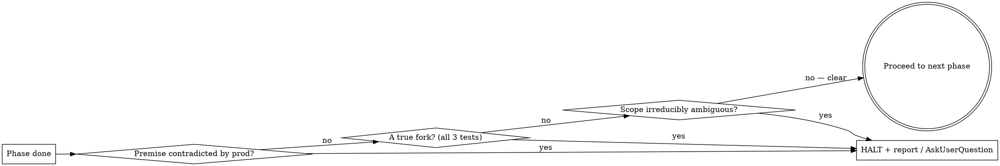

# execute — read → validate → scope → plan → build → test → ship

Drive a single task from request to opened PR in one pass, wiring together the substrate that already exists: validate-against-prod (the `/flushdeployed` mindset), `superpowers:writing-plans`, TDD, isolated worktrees, and `/PRlaunch`. **This skill is mostly orchestration — its job is to call the right existing skills in the right order and to know exactly when to stop and ask.**

**Core principle — autonomous when clear, ask only on a true fork.** Once the work is scoped and planned, run all the way to `/PRlaunch` without a check-in **as long as execution is clear**. Stop ONLY for a genuine fork (defined below) or when validation/scoping is *not* clear. "No gate needed if clear execution" — Matt. Do not invent checkpoints; do not barrel past a real fork.

**Build always happens in an isolated git worktree** (`superpowers:using-git-worktrees`) on a fresh feature branch — never the live tree, never `main`.

## Entry point: `/execute [DEV-NNNN | URL | free-form task]`

- `DEV-NNNN` or a Linear URL → fetch the issue and treat its body as the task.
- Free-form ("execute: add X to Y") → that text is the task.
- No argument → ask: "What's the one thing to execute?"

## The pipeline

Track all 8 phases with TodoWrite. Each phase's output feeds the next; don't skip ahead.

### 1. Read
Load the full task. If a `DEV-NNNN`/URL was given, `mcp__linear__get_issue` for the real description, comments, project, and labels — don't work from the title alone. Restate the task in one or two sentences so the target is unambiguous.

### 2. Validate against prod code  ⟵ *the phase that makes /execute different*
**The ticket's premise is a claim to verify, not trust** (same stance as `/flushdeployed`). Before planning a single line, confirm against ACTUAL production code that the work is real and described correctly:
- **Does it already exist?** Run Matt's global rule #6 discovery across all three: (a) **Linear** for the *concern* (product/SKU/epic, not the ticket name), (b) `grep` the ecosystem for the concern, (c) `mcp__reeve-memory__memory_search` the FULL memory (the injected `<memory>` preview is truncated). Default stance: "it probably exists, find it."
- **Is the described state accurate?** Read the prod code the ticket assumes. Is the bug reproducible? Is the architecture as described? Is the file/route/table actually where the ticket says?
- **Two dead-ends → switch substrate** (rule #7). After ~2 failed searches for the same fact, stop varying the query and go look at the real surface (live UI via Playwright, `screencapture` + Read, Linear, the source-of-truth API), don't run a third grep.

**If the premise is wrong** — the capability already exists, the bug doesn't reproduce, the ticket assumes an architecture that isn't there — **HALT and report.** Do not build the wrong thing. This counts as a stop condition (treat like a fork): tell Matt what prod actually shows and what you'd do instead, and wait.

### 3. Scope
Define the shippable unit: what's IN, what's explicitly OUT, and the success criteria ("done when…"). YAGNI ruthlessly. One `/execute` = one branch = one PR = (ideally) one ticket. If the request is really several independent subsystems, say so and propose decomposing before planning. **Stay in your lane** (rule #5): if delivering this requires changing a *different* repo, name it and stop for approval — don't hop repos.

### 4. Plan
Invoke `superpowers:writing-plans` to produce the implementation plan against the validated scope.
- **Spec/plan output goes to Linear, never a local file handed to Matt** (Matt's global "Specs & Brainstorming Output" rule — this overrides writing-plans' default `docs/superpowers/specs/` location). Put the plan in the **ticket description**; if no ticket exists yet, file one now (right project, `Reeve.*` + `Reeve.Platform` labels) so it exists before build — and so `/PRlaunch`'s pr-gate (which blocks PRs lacking a `DEV-NNN` link) is satisfied. An internal scratch copy of the plan is fine as your own working notes; it is never the deliverable.

### 5. Decide: ask on true forks only
A **true fork** is a decision where ALL of these hold: (a) 2+ viable paths exist, (b) they produce materially different outcomes, and (c) the choice depends on Matt's intent / product / business context that you **cannot** derive from the ticket, the code, or a sensible default. Ask these with `AskUserQuestion` — lead with your recommendation.

Everything else you decide yourself and keep moving:

| Decide yourself (NOT a fork) | Ask Matt (true fork) |
|---|---|
| Naming, file placement, formatting | Two designs with different product/UX consequences |
| Which existing util/substrate to reuse | A scope cut that drops something Matt may want |
| Test framework already in the repo | Touching another repo / shared substrate one-brain decision |
| Obvious fix for a clearly-understood bug | Premise contradicted by prod (from phase 2) |
| Anything verifiable in the codebase | A migration/destructive step that's hard to reverse |

**If there are no true forks and execution is clear, do NOT pause for approval — go straight to build.** Bundle any forks into a single batched ask; don't drip them one message at a time.

### 6. Reuse existing substrate
Build ON what exists. The phase-2 discovery already found the relevant substrate — use it (extend the service, the component, the endpoint pattern) rather than inventing a parallel mechanism. Only build from scratch after discovery genuinely came back empty (rule #6). Match the surrounding code's style, naming, and idioms.

### 7. Build
- Create the **isolated worktree + feature branch** (`superpowers:using-git-worktrees`); branch name `matt/dev-NNNN-slug` so the `linear-startwork` hook flips the ticket to In Progress.
- Implement with `superpowers:test-driven-development` (test → red → minimal code → green → refactor).
- For a plan with independent tasks, use `superpowers:subagent-driven-development` / `superpowers:executing-plans`.
- Hit a bug? `superpowers:systematic-debugging` — find root cause before patching. Never gut complexity to dodge a bug (rule #2: move forward, never regress).

### 8. Test, then ship
- Run the REAL tests/build and read the output. `superpowers:verification-before-completion` — evidence before any "it works" claim (rule #1: never hallucinate; verify before asserting).
- Then invoke **`/PRlaunch`**, which runs the three local quality gates (deep-review → CR CLI → outcome eval), opens the PR, and wraps up. `/execute` ends where `/PRlaunch` begins — don't duplicate its gates here.

## When to stop vs. keep going

## Quick reference

| Phase | Action | Existing skill / tool |
|---|---|---|
| 1 Read | Fetch ticket / capture task | `mcp__linear__get_issue` |
| 2 Validate | Verify premise vs prod; find existing | rule #6 (Linear + grep + `memory_search`), `/flushdeployed` stance |
| 3 Scope | In/out + success criteria; stay in lane | rule #5 |
| 4 Plan | Plan → **Linear ticket** (not local file) | `superpowers:writing-plans` + Matt's Linear-spec rule |
| 5 Forks | Ask only true forks, batched | `AskUserQuestion` |
| 6 Reuse | Build on existing substrate | rule #6 |
| 7 Build | Isolated worktree, TDD | `using-git-worktrees`, `test-driven-development`, `systematic-debugging` |
| 8 Ship | Verify, then PR + wrap | `verification-before-completion`, `/PRlaunch` |

## Common mistakes

- **Skipping phase 2.** Planning straight from the ticket builds whatever the ticket assumed — including things that already exist or bugs that aren't real. Validate first.
- **Over-asking.** Pausing for naming, file placement, or "is this OK?" on decisions with an obvious default. That's not a fork — decide and move.
- **Under-asking.** Silently picking one path on a real product/architecture fork because asking felt slower. If the choice needs Matt's intent, ask.
- **Writing the plan to a local `.md` and handing it over.** Specs live in Linear. The local copy is scratch, never the deliverable.
- **Building in the live tree or on `main`.** Always an isolated worktree + feature branch.
- **Re-running PRlaunch's gates inside execute.** Build + test here; the three quality gates belong to `/PRlaunch`. Don't duplicate.
- **Hopping repos without permission.** If the fix needs another repo, name it and stop (rule #5).
